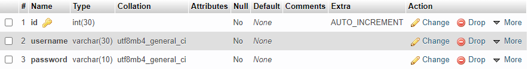
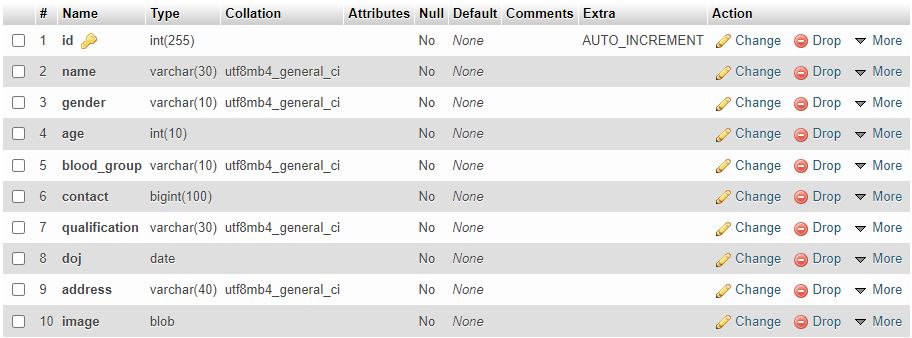
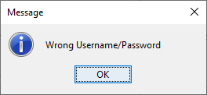
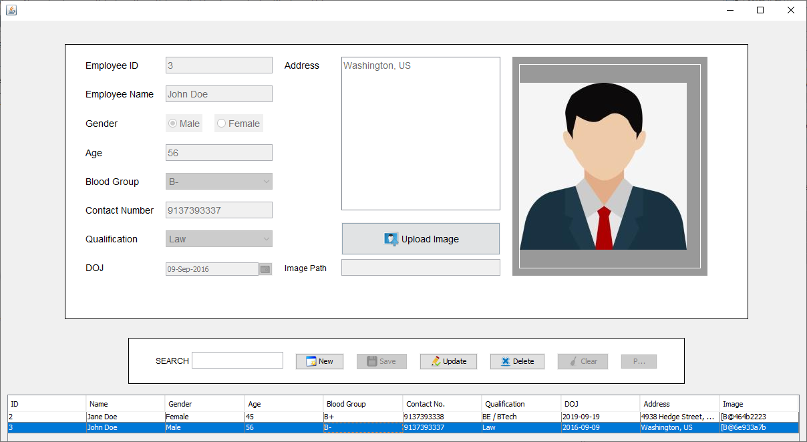

# Employee Management

A simple employee management system based on Java, build with the help of NetBeans IDE 12.4. This project uses the Java Swing Library along with AWT (Abstract Window Toolkit), JDBC (Java Database Connectivity) API and uses MySQL as database.

## Tech Stack

**Tools:** NetBeans IDE 12.4, XAMPP 8.0.9

**Tech:** Java Swing, AWT, JDBC, MySQL


  
## Prerequisites

* Install Java (JDK 9+), NetBeans IDE 12.4, XAMPP 8.0.9.
* Clone the project
```
https://github.com/Sahethi/employee-management.git

cd employee-management
```

## Installation 

* Open NetBeans > File > Open Project. Navigate to this particular folder and select the NetBean Project with NetBeans icon.
* Open XAMPP and start **Apache** and **MySQL**
    * Open the browser of your choice and type localhost in your URL bar. 
    * This should open XAMPP dashboard. Now Click on **phpMyAdmin** 
    * This should open phpMyAdmin page. You now have to create a database, click on the **new** button on the left menu, this will open Databases page, enter your database name and click create. For this project database name is **employee_mgmt**.
    * **employee_mgmt** database will have 2 tables with the following schemas.
    * **user** Table Schema

    
    * **employees** Table Schema
    
    
* After setting up, open NetBeans Project. Expand the project and right click on the **Libraries** folder and click on **Add JAR/Folder**. 
    * Navigate to **employee-management** > **jar** and add your .jar files as dependencies to the project. Files you would need.
        * jcalendar-1.4.jar
        * mysql-connector-java-5.1.24-bin.jar
        * rs2xml.jar
        * thumbnailator-0.4.7-all.jar
* Run the project.

## Prerequisites

* Login Module.


    
* Unsuccessful Login will display this error message.


    
* Employee Module after successful login.

    

## References

* [Java Docs](https://docs.oracle.com/javase/8/docs/technotes/guides/jdbc/)
* [phpMyAdmin - MySQL](https://www.youtube.com/watch?v=IV6vGuHcQy8) 


## Authors

- [@Sahethi](https://www.github.com/Sahethi)